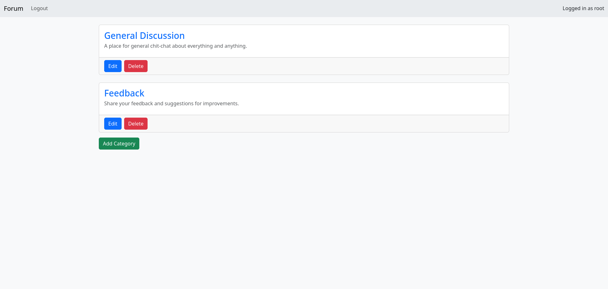
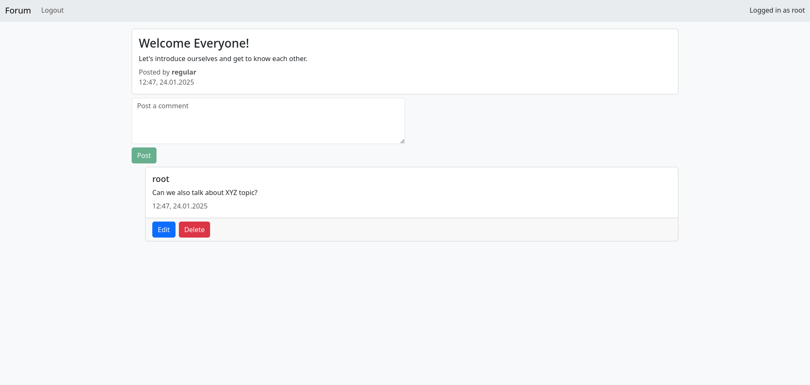

# About

Fullstack single-page web app developed for one of my university classes using the MEAN stack. It is a simple forum with categories, threads and comments.

# Preview



# Running the app

## Using docker compose

Run `docker compose up -d` in the root directory of the project and open `localhost:3000` in your web browser.

Two default users are created: root and regular.

 **root** has admin privileges while **regular** does not.

### Logging in as root
  ```
  username: root
  password: rootpass
  ```
### Logging in as regular
  ```
  username: regular
  password: regpass
  ```